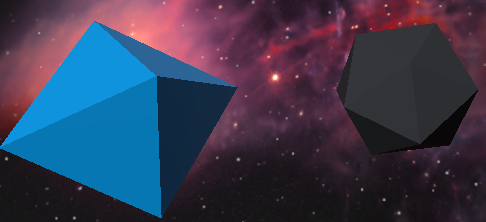

# Escape Geabrande - Space Battle VR Game

Escape Geabrande is an immersive virtual reality (VR) game that throws players into a thrilling space battle. With the goal of saving a friend and returning home, players must face a massive alien adversary, strategically utilize power-ups, and navigate through a hazardous space environment. The game was developed using Unity, incorporating a variety of assets and 3D models to create a captivating gameplay experience.

Project Duration: 4 months

  
   

## Features

- **Intense Space Battle:** Engage in an epic showdown with a colossal alien in the vastness of space.
  
- **Dynamic Power-Ups:** Destroy meteors and collect power-ups that grant you advantages such as shields, increased movement speed, max health, and quad shots.
  
  | Power-up | Description |
  | -------- | ----------- |
  | Shield   | Provides a protective barrier against attacks. |
  | Movement Speed | Increases your spacecraft's agility and speed. | 
  | Max Health Boost | Increases your spacecraft's maximum health capacity. |
  | Quad Shots | Enables your spacecraft to fire four shots at once. |

  
  
  
  
- **VR Immersion:** Escape Geabrande offers an immersive VR experience through Google Cardboard, providing an engaging and interactive gameplay environment.
  
- **Realistic Space Elements:** Navigate through a hazardous field of meteors, asteroids, and debris, requiring skillful maneuvering to survive.
  
- **Audio Engagement:** Immerse yourself further with a rich audio experience, including meteor launch cues, explosion sounds, and an intense background theme.
  
- **Diverse Assets:** The game features a range of meticulously designed 3D models, animations, particles, and sound effects to enhance the visual and auditory aspects of the gameplay.

## Gameplay

1. **Engage the Alien**: Enter a high-stakes battle against a massive alien that threatens your existence and the universe as you know it.
2. **Collect Power-Ups**: Destroy meteors to collect power-ups, including shields, speed boosts, health upgrades, and quad shots.
3. **Dodge Space Debris**: Evade incoming meteors, asteroids, and debris while maintaining your focus on the alien threat.
4. **Immersive VR Controls**: Utilize Google Cardboard VR controls for seamless and accessible gameplay.
5. **Strategic Decision-Making**: Choose when to collect power-ups and when to engage the alien, balancing offense and defense.
6. **Audio Cues**: React to audio cues, including meteor launch alerts, shot sounds, and explosions, to stay aware of your surroundings.
7. **Intense Soundtrack**: Experience heightened intensity with a gripping background theme that enhances the gaming atmosphere.

## Perspectives

### First Person Perspective

Experience the action from the cockpit of your spacecraft. Immerse yourself in the game's world with a first-person perspective that puts you right in the middle of the cosmic battle. React swiftly to threats and maneuver through space with unparalleled realism.

### Third Person Perspective

Gain a comprehensive view of the battlefield with the third-person perspective. Witness the grandeur of space and the scale of the alien threat while navigating through the treacherous debris-filled environment.

## Collectibles

### Asteroids

Destroy asteroids to collect power-ups and enhance your capabilities. Asteroids can drop essential items that aid in your battle against the alien.

### Meteors

Dodge the deadly meteor showers launched by the alien, testing your reflexes and maneuvering skills. Navigate through the onslaught of meteors to survive and continue the battle against the alien threat.

### Perks

Collect power-ups that provide various benefits such as shields, speed boosts, increased health, and quad shots. Strategically acquire and utilize these perks to gain an edge in the fight.

### Alien Avatar

Confront the menacing alien that stands between you and your mission to save your friend and return home. Prepare for an intense battle against this formidable adversary.

## Future Enhancements (Checklist)

- [ ] **Flight Simulators Integration:** Explore integration with flight simulators to enhance control and movement mechanics, providing a more immersive space flight experience.

- [ ] **Expanded Audio Cues:** Add more audio cues to signal various in-game events, including power-up collection and alien spellcasting, enhancing the audio feedback.

- [ ] **Multiplayer Mode:** Implement a multiplayer mode that enables players to team up against the alien threat, fostering cooperation and teamwork.

- [ ] **Diverse Bosses and Ships:** Introduce a variety of bosses with distinct abilities and ships with customizable colors, offering diverse gameplay experiences.

- [ ] **New Power-ups:** Introduce additional power-ups that introduce novel gameplay dynamics and reward strategic decision-making.

- [ ] **Enhanced Visuals:** Add more particle effects, refine asteroid and meteor designs, and create engaging animations for the first-person ship perspective.

- [ ] **Innovative Controls:** Explore incorporating visual representations of ship movement through a steering wheel and accelerator, deepening the sense of immersion.

- [ ] **Extended Universe:** Expand the game's universe with a broader narrative, potentially leading to sequels or spin-offs exploring different aspects of the game world.

- [ ] **Increased Interactivity:** Introduce more interactive objects in the space environment, such as space stations and cosmic phenomena, enhancing gameplay variety.

## Installation

To experience the space battle adventure of Escape Geabrande, follow these steps:

1. Clone this repository to your local machine.
2. Open the project in Unity.
3. Configure VR settings for Google Cardboard VR.
4. Build the game for Android devices.
5. Install the game on your Android device and immerse yourself in the battle!

## Credits

### Game Assets

1. **Perks Shape and Color**: [Simple Gems Ultimate Animated Customizable Pack](https://example.com/perks-gems-pack)
2. **Asteroids**: Breakable Asteroids (provided a means of the asteroids breaking apart but was removed due to performance issues)
3. **Explosion Animation/Sound**: [Detonator Explosion Framework](https://example.com/detonator-explosion)
4. **Laser Sound Effect**: [Free Laser Weapons](https://example.com/free-laser-weapons)
5. **Sample Ships/Bullets**: [Hi-Rez Spaceships Creator Free Sample](https://example.com/spaceships-creator)
6. **Particles (Hitting Alien/Healing/Spawning)**: [Particle Ribbon](https://example.com/particle-ribbon)
7. **Scene Skyblock**: [SpaceSkies Free](https://example.com/spaceskies-free)
8. **Background Theme Music**: Universe Sounds Free Pack

### Alien Avatar/Animations

- Alien avatar/animations were created using Mixamo.

### Homescreen Design

- The homescreen design was created using Photopea.
  
## Contributions

Contributions to Escape Geabrande are welcomed! Feel free to submit pull requests, suggest new features, or report any issues you encounter.

---

Embark on a journey through space, face off against a colossal alien, and save your friend in Escape Geabrande. Are you prepared for the ultimate space battle adventure?

*Note: This game is intended for Android devices and is compatible with Google Cardboard VR.*

